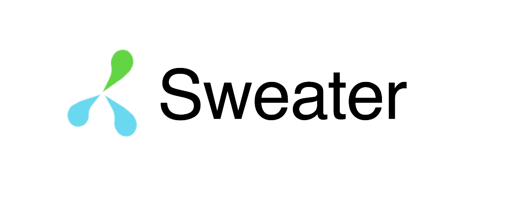
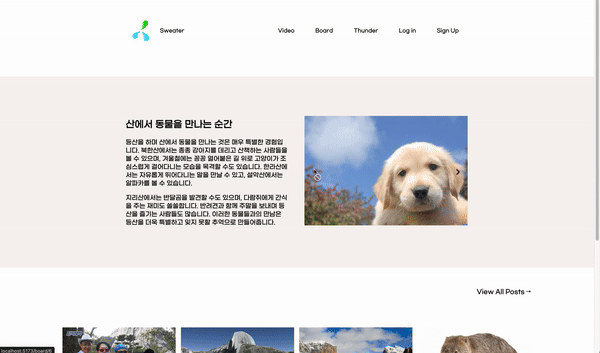
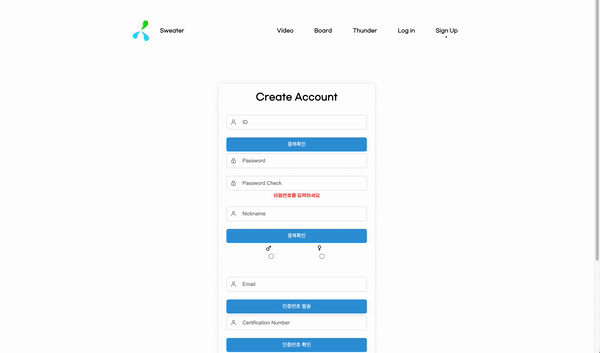
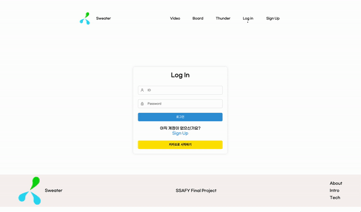
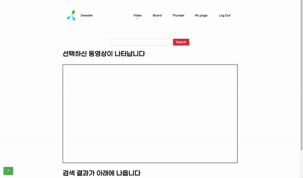
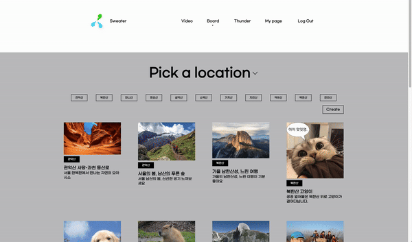
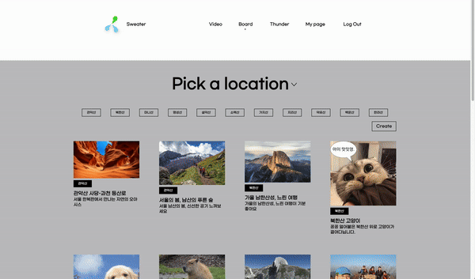
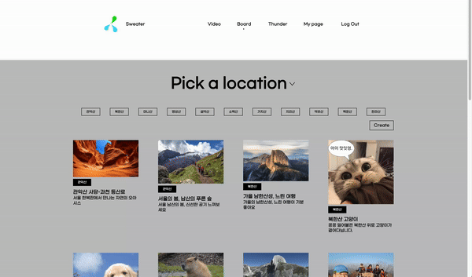
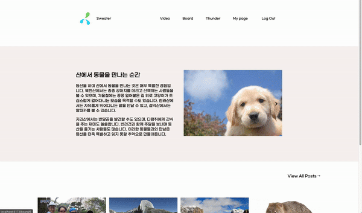
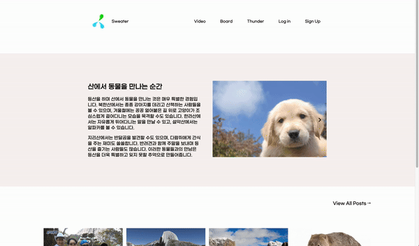

# 등산 커뮤니티 Sweater

  

## 📢 프로젝트 소개
* **Sweater**는 등산을 좋아하는 사람들이 자신의 등산 경로를 공유하고, 다른 사람과 함께 등산할 수 있는 소셜 커뮤니티입니다.
* **Video 페이지**의 AI 챗봇을 활용하여, 다양한 등산 정보를 얻거나 관련 동영상을 시청할 수 있습니다.
* **Board와 Thunder 페이지**의 지역 및 태그 선택을 통해, 사용자는 원하는 정보를 필터링 할 수 있습니다.
* **Board와 Thunder 게시글 생성 시**, 사용자는 지도에서 등산로를 지정하여 나만의 등산로를 만들 수 있습니다.
* **Board와 Thunder 상세 게시글에서**, 댓글로 소통할 수 있으며 Thunder에서는 Invite로 유저끼리 소통할 수 있습니다.
* **My Page**에서 프로필 사진과 소개를 설정하고, 나의 게시글과 댓글 그리고 나에게 온 메시지 목록을 확인할 수 있습니다.
* **카카오 소셜 로그인**을 통해서 회원가입 및 로그인을 할 수 있습니다.

## 👩🏻‍💻 팀원 구성
* **정상영**
  - 역할 : Front-end
  - 주요 구현 기능: 나의 등산로, 동영상 검색 
* **최다환**
  - 역할 : Back-end
  - 주요 구현 기능: AI 챗봇, 소셜 로그인

## 💻 개발 환경
* **Front**: HTML, CSS, JavaScript, Vue.js
* **Back**: Java, SpringBoot, MyBatis
* **DataBase**: MySQL
* **버전 관리**: Gitlab
* **협업 툴**: Notion, Mattermost
* **디자인**: Figma
* **코드 컨벤션**: Prettier

## 🗓️ 개발 기간 및 작업 관리
* **전체 개발 기간**: 2024-05-16 ~ 2024-05-23
* **기획 및 목업 제작**: 2024-05-16 ~ 2024-05-17
* **기능 구현**: 2024-05-18 ~ 2024-05-23

## 📄 페이지 별 기능
1. **Main**
   - 추천 컨텐츠 및 신규 게시글을 볼 수 있는 섹션이 있습니다.
   - Nav의 심볼을 누르면 애니메이션과 함께 Main 페이지로 이동합니다.
   

     
   

2. **Sign up**
   - ID, 패스워드, 닉네임을 DB와 비교하여 유효성 검사를 진행하며, 통과하지 못한 경우 경고 문구가 표시됩니다.
   - 이메일 인증으로 인증번호를 받아 인증 후 가입 가능하도록 구현했습니다.
   

     
   

3. **Log In**
   - DB에서 회원 정보를 찾아, 로그인 할 수 있습니다.
   - 카카오 소셜 로그인을 구현했습니다.
   

     
   

4. **My Page**
   - 사진을 클릭하면 프로필 이미지를 변경할 수 있습니다.
   - 자기소개글을 등록 및 수정할 수 있습니다.
   - 나의 게시글과 댓글 목록, 좋아요한 게시글, 댓글 목록, 메시지를 확인할 수 있습니다.
   

     
   

5. **Video**
   - AI 챗봇과 대화할 수 있습니다.
   - 동영상을 검색할 수 있습니다.
   

     
   

6. **Board**
   - 지역과 산으로 게시글을 필터링 할 수 있습니다.
   

     
   

   - 로그인 한 상태에서 내가 작성하지 않은 글이라면, 좋아요를 누를 수 있습니다.
   - 댓글을 작성할 수 있습니다.
   

     
   

   - 작성 시 지도를 커스터마이징해서 나만의 등산로를 생성할 수 있습니다. 나만의 등산로는 DB에 게시글과 연동되어 저장됩니다.
   

     
   

7. **Thunder**
   - 지역과 산으로 게시글을 필터링 할 수 있습니다.
   

     
   

   - 로그인 한 상태에서 내가 작성하지 않은 글이라면, 좋아요를 누를 수 있습니다.
   - 댓글을 작성할 수 있습니다.
   - 작성 시 지도를 커스터마이징해서 나만의 등산로를 생성할 수 있습니다. 나만의 등산로는 DB에 게시글과 연동되어 저장됩니다.
   

     
   

   - 댓글을 통해 유저와 소통할 수 있으며, Invite를 통해 생성한 메시지는 My Page에서 확인할 수 있습니다.

## 📖 회고

### 잘한 점
- RESTful API의 흐름을 알게 되어, 디버깅 시 백엔드 코드 이해가 수월했던 점
- 다양한 API(Youtube, KakaoMap, KakaoLogin, Open AI)와 라이브러리(Proj4.js, tiptap 등)를 적용한 점
- 기획 초기 단계에 많은 시간을 활용해서, 이후에 아키텍처 변경이나 기능 추가에도 유연하게 대응할 수 있었던 점

### 부족한 점
- 타이트한 일정과 개발 우선순위로 인해 리팩토링에 시간을 많이 할애하지 못한 점
- 설계했던 디자인 요소들을 다 구현하지 못한 점

### 총평

그간 실무 혹은 기획자로서의 프로젝트 경험은 있었지만, 개발자의 입장에서 제품을 만드는 경험은 전혀 달랐습니다.

첫 번째로, 협업의 중요성을 절실히 느꼈습니다. 평소에는 협업 능력이 부족하지 않다고 생각했지만, 이번 프로젝트에서 일정 관리, 목표 관리 등 여러 과정에서 제가 페어를 괴롭히거나 진행을 더디게 하는 상황이 발생했습니다. 앞으로 프로젝트를 통해 협업 능력을 지속적으로 기르고 싶습니다.

두 번째로, 배울 것이 아직 많다는 것을 몸소 느꼈습니다. Vue3 공식 문서를 많이 읽었다고 자만했지만, 프로젝트 진행 중 접한 다양한 오픈소스 라이브러리와 신기술들을 보며 겸손함과 학습 의지를 다시 한번 갖게 되었습니다. 프로젝트가 끝난 후에는 웹사이트를 직접 만들며 공부한 내용을 기록할 계획입니다.

세 번째로, 공식 문서나 오픈소스에 기여하고 싶다는 목표가 생겼습니다. Vue3 번역 문서에서 오타를 발견하고 기여해본 경험과, vue3-kakao-map 라이브러리를 활용하며 얻은 동기 덕분입니다. 개발 역량을 기르는 것 외에도 개발 커뮤니티에 작게나마 기여할 수 있게 되길 바랍니다.

마지막으로 한 학기 동안의 성장을 돌아보게 되었습니다. 입교 초기에는 알고리즘과 개발 분야가 낯설어 커리어에 대한 의구심이 있었습니다. 하지만 Spring, 프론트엔드 등을 차근차근 배우며 프로그래밍에 재미를 붙였고, 최근 알고리즘 평가에서도 좋은 결과를 얻었습니다. 이렇게 유의미한 한 학기를 보낼 수 있었던 것은 프로젝트 페어와 반 친구들의 도움이 컸기에 그들에게 감사의 마음을 전합니다.

전체적으로 이번 프로젝트를 통해 개발 역량뿐 아니라 협업, 학습 태도, 커뮤니티 기여 등 다방면에서 성장할 수 있었습니다. 앞으로도 지속적인 노력으로 더 나은 개발자가 되고 싶습니다.
